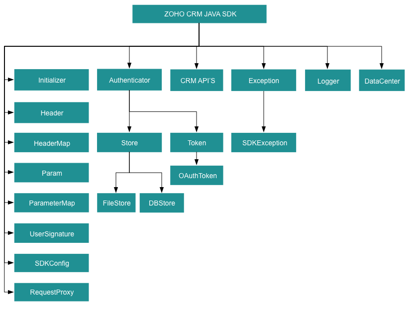

License
=======

    Copyright (c) 2021, ZOHO CORPORATION PRIVATE LIMITED 
    All rights reserved. 

    Licensed under the Apache License, Version 2.0 (the "License"); 
    you may not use this file except in compliance with the License. 
    You may obtain a copy of the License at 
    
        http://www.apache.org/licenses/LICENSE-2.0 
    
    Unless required by applicable law or agreed to in writing, software 
    distributed under the License is distributed on an "AS IS" BASIS, 
    WITHOUT WARRANTIES OR CONDITIONS OF ANY KIND, either express or implied. 
    See the License for the specific language governing permissions and 
    limitations under the License.

# ZOHO CRM JAVA SDK 6.0 for API version 6

## Table Of Contents

* [Overview](#overview)
* [Registering a Zoho Client](#registering-a-zoho-client)
* [Environmental Setup](#environmental-setup)
* [Including the SDK in your project](#including-the-sdk-in-your-project)
* [Using the Java SDK for Zoho CRM through Maven
](#using-the-java-sdk-for-zoho-crm-through-maven
)
* [Persistence](#token-persistence)
  * [DataBase Persistence](#database-persistence)
  * [File Persistence](#file-persistence)
  * [Custom Persistence](#custom-persistence)
* [Configuration](#configuration)
* [Initialization](#initializing-the-application)
* [Class Hierarchy](#class-hierarchy)
* [Responses And Exceptions](#responses-and-exceptions)
* [Threading](#threading-in-the-java-sdk)
  * [Multithreading in a Multi-User App](#multithreading-in-a-multi-user-app)
  * [Multi-threading in a Single User App](#multi-threading-in-a-single-user-app)
* [Sample Code](#sdk-sample-code)

## Overview

Zoho CRM JAVA SDK offers a way to create client Java applications that can be integrated with Zoho CRM.

## Registering a Zoho Client

Since Zoho CRM APIs are authenticated with OAuth2 standards, you should register your client app with Zoho. To register your app:

- Visit this page [https://api-console.zoho.com/](https://api-console.zoho.com)

- Click `ADD CLIENT`.

- Choose the `Client Type`.

- Enter **Client Name**, **Client Domain** or **Homepage URL** and **Authorized Redirect URIs**. Click `CREATE`.

- Your Client app will be created.

- Select the created OAuth client.

- Generate grant token by providing the necessary scopes, time duration (the duration for which the generated token is valid) and Scope Description.

## Environmental Setup

JAVA SDK requires Java (version 8 and above) to be set up in your development environment.

## Including the SDK in your project

Java SDK is available through Maven distribution. You can include the SDK to your project using:

1. Maven

    - pom.xml file.

    ```xml
    <repositories>
        <repository>
            <id>zohocrmsdk-6-0</id>
            <url>https://maven.zohodl.com</url>
        </repository>
    </repositories>
    <dependencies>
        <dependency>
            <groupId>com.zoho.crm</groupId>
            <artifactId>zohocrmsdk-6-0</artifactId>
            <version>1.0.0</version>
        </dependency>
    </dependencies>
    ```

2. Gradle

    ```gradle
    repositories{
        maven { url "https://maven.zohodl.com" }
    }
    dependencies{
        implementation 'com.zoho.crm:zohocrmsdk-6-0:1.0.0'
    }
     ```

### Dependency JARs

[commons-lang3-3.9.jar](https://mvnrepository.com/artifact/org.apache.commons/commons-lang3/3.9)

[commons-logging-1.1.3.jar](https://mvnrepository.com/artifact/commons-logging/commons-logging/1.1.3)

[httpclient-4.4.1.jar](https://mvnrepository.com/artifact/org.apache.httpcomponents/httpclient/4.4.1)

[httpcore-4.4.4.jar](https://mvnrepository.com/artifact/org.apache.httpcomponents/httpcore/4.4.4)

[httpmime-4.5.3.jar](https://mvnrepository.com/artifact/org.apache.httpcomponents/httpmime/4.5.3)

[json-20170516.jar](https://mvnrepository.com/artifact/org.json/json/20170516)

[mysql-connector-java-8.0.19.jar](https://mvnrepository.com/artifact/mysql/mysql-connector-java/8.0.19)

[opencsv-4.6.jar](https://mvnrepository.com/artifact/com.opencsv/opencsv/4.6)

## Using the Java SDK for Zoho CRM through Maven

Follow the below steps to use the Java SDK for Zoho CRM through Maven.

- Create a Maven project.

- Place the below code in your pom.xml file of your Maven project.

    ```xml
    <repositories>
        <repository>
            <id>zohocrmsdk-6-0</id>
            <url>https://maven.zohodl.com</url>
        </repository>
    </repositories>
    <dependencies>
        <dependency>
            <groupId>com.zoho.crm</groupId>
            <artifactId>zohocrmsdk-6-0</artifactId>
            <version>1.0.0</version>
        </dependency>
    </dependencies>
    ```

- Update the maven project.
  - Under project explorer, right-click the project name, select **Maven** > **Update Project**. The jar will be downloaded in the maven dependencies.

- Inside your source code, import the appropriate files from the SDK.

- Generate the grant token when you initialize your application.

## Token Persistence

Token persistence refers to storing and utilizing the authentication tokens that are provided by Zoho. Token persistence enables the SDK to automatically refresh the access token after initialization using the refresh token without the need for user intervention. There are three ways provided by the SDK in which persistence can be utilized. They are DataBase Persistence, File Persistence, and Custom Persistence. Please note that the default method of token persistence provided by the Zoho CRM SDK is File persistence.

### Table of Contents

- [DataBase Persistence](#database-persistence)

- [File Persistence](#file-persistence)

- [Custom Persistence](#custom-persistence)

### Implementing OAuth Persistence

Once the application is authorized, OAuth access and refresh tokens can be used for subsequent user data requests to Zoho CRM. Hence, they need to be persisted by the client app.

The persistence is achieved by writing an implementation of the inbuilt **TokenStore interface**, which has the following callback methods.

- **findToken(Token token)** - invoked before firing a request to fetch the saved tokens. This method should return an implementation of **Token interface** object for the library to process it.

- **saveToken(Token token)** - invoked after fetching access and refresh tokens from Zoho.

- **deleteToken(String id)** - invoked before saving the latest tokens.

- **getTokens()** - The method to retrieve all the stored tokens.

- **deleteTokens()** - The method to delete all the stored tokens.

- **findTokenById(String id)** - The method to retrieve the user's token details based on unique ID.

### DataBase Persistence

Database persistence is a technique that involves storing and retrieving data from a database. In case the user prefers to use the default DataBase persistence, **MySQL** can be used.

- Create a table in your Database with required columns

  - id varchar(10)

  - user_name varchar(255)

  - client_id varchar(255)

  - client_secret varchar(255)

  - refresh_token varchar(255)

  - access_token varchar(255)

  - grant_token varchar(255)

  - expiry_time varchar(20)

  - redirect_url varchar(255)

  - api_domain varchar(255)
  

Note:
- Custom database name and table name can be set in DBStore instance.

#### MySQL Query

```sql
CREATE DATABASE zohooauth;
CREATE TABLE oauthtoken (
  id varchar(10) NOT NULL,
  user_name varchar(255),
  client_id varchar(255),
  client_secret varchar(255),
  refresh_token varchar(255),
  access_token varchar(255),
  grant_token varchar(255),
  expiry_time varchar(20),
  redirect_url varchar(255),
  api_domain varchar(255),
  primary key (id)
);
```

#### Create DBStore object

```java
/*
* Create an instance of TokenStore.
* host -> DataBase host name. Default "jdbc:mysql://localhost"
* databaseName -> DataBase name. Default "zohooauth"
* userName -> DataBase user name. Default "root"
* tableName -> DataBase table name. Default "oauthtoken"
* password -> DataBase password. Default ""
* portNumber -> DataBase port number. Default "3306"
*/
//TokenStore tokenstore = new DBStore.Builder().build();
		
TokenStore tokenstore = new DBStore.Builder()
.host("hostName")
.databaseName("databaseName")
.tableName("tableName")
.userName("userName")
.password("password")
.portNumber("portNumber")
.build();
```

### File Persistence

In case of default File Persistence, the user can persist tokens in the local drive, by providing the the absolute file path to the FileStore object.

- The File contains

  - id

  - user_name

  - client_id

  - client_secret

  - refresh_token

  - access_token

  - grant_token

  - expiry_time

  - redirect_url

  - api_domain

#### Create FileStore object

```java
//Parameter containing the absolute file path to store tokens
TokenStore tokenstore = new FileStore("/Users/java_sdk_token.txt");
```

### Custom Persistence

Users can create their own logic for storing and retrieving authentication tokens using the custom persistence technique. To use Custom Persistence, you must implement **TokenStore interface**(**com.zoho.api.authenticator.store.TokenStore**) and override the methods.

```java
import java.util.List;
import com.zoho.api.authenticator.Token;
import com.zoho.crm.api.exception.SDKException;
import com.zoho.api.authenticator.store.TokenStore;

public class CustomStore implements TokenStore
{
	@Override
	public Token findToken(Token token) throws SDKException
	{
		return null;
	}

	@Override
	public Token findTokenById(String id) throws SDKException
	{
		return null;
	}

	@Override
	public void saveToken(Token token) throws SDKException
	{

	}

	@Override
	public void deleteToken(String id) throws SDKException
	{

	}

	@Override
	public List<Token> getTokens() throws SDKException
	{
		return null;
	}

	@Override
	public void deleteTokens() throws SDKException
	{

	}
}

```

## Configuration

Before you get started with creating your Java application, you need to register your client and authenticate the app with Zoho.

| Mandatory Keys    | Optional Keys |
| :---------------- | :------------ |
| environment       | logger        |
| token             | store         |
|                   | SDKConfig     |
|                   | requestProxy  |
|                   | resourcePath  |
----

The **environment** key contains the domain information to make API calls. The **token** key represents the OAuth info, including the clientID, clientSecret, grantToken, redirectURL, refreshToken or accessToken depending on the flow that you use. Refer to ##create an instance of OAuthToken## for more details.

- Configure the API environment which decides the domain and the URL to make API calls.

    ```java
    /*
        * Configure the environment
        * which is of the pattern Domain.Environment
        * Available Domains: USDataCenter, EUDataCenter, INDataCenter, CNDataCenter, AUDataCenter,CADataCenter
        * Available Environments: PRODUCTION, DEVELOPER, SANDBOX
    */
    Environment environment = USDataCenter.PRODUCTION;
    ```
- Create an instance of **OAuthToken** with the information that you get after registering your Zoho client. In the context of token persistence, the grant token flow and refresh token flow involve storing and persisting the token. However, the access token flow does not involve token persistence and the access token is directly utilized for API calls. Depending on the tokens available with you, choose grantToken flow, refreshToken flow or accessToken flow.  

  - By default, the findUser key is set to true, to set userSignature. However, this requires the ***ZohoCRM.users.READ*** and ***ZohoCRM.org.READ*** scopes to be mandatory. If you do not want to set userSignature, you must set the findUser key to false.

  - Use the following method for **grantToken flow :**
  ```java
    Token token = new OAuthToken.Builder()
    .clientID("clientId")
    .clientSecret("clientSecret")
    .grantToken("grantToken")
    .redirectURL("redirectURL")
    .findUser(false)// by default true
    .build();
    ```
  - Use the following method for **refreshToken flow :**
  ```java
    Token token = new OAuthToken.Builder()
    .clientID("clientId")
    .clientSecret("clientSecret")
    .refreshToken("refreshToken")
    .findUser(false)// by default true
    .build();
  ```

  - Use the following method for **accessToken flow :**
  ```java
    Token token = new OAuthToken.Builder()
    .accessToken("accessToken")
    .findUser(false)// by default true
    .build();
  ```

  - Use the following method for **Id flow :**
  ```java
    Token token = new OAuthToken.Builder()
    .id("id") // available in token store
    .build();
  ```

- Create an instance of **Logger** Class to log exception and API information.

    ```java
    /*
    * Create an instance of Logger Class that takes two parameters
    * level -> Level of the log messages to be logged. Can be configured by typing Levels "." and choose any level from the list displayed.
    * filePath -> Absolute file path, where messages need to be logged.
    */
    Logger logger = new Logger.Builder()
    .level(Levels.INFO)
    .filePath("/Users/java_sdk_log.log")
    .build();
    ```

- Create an instance of **TokenStore** to persist tokens, used for authenticating all the requests. By default, the SDK creates the sdk_tokens.txt file in the project folder to persist the tokens.

    - Use the following method for DB Store
    ```java
    /*
    * Create an instance of DBStore that requires the following
    * host -> DataBase host name. Default value "localhost"
    * databaseName -> DataBase name. Default  value "zohooauth"
    * userName -> DataBase user name. Default value "root"
    * password -> DataBase password. Default value ""
    * portNumber -> DataBase port number. Default value "3306"
    * tabletName -> DataBase table name. Default value "oauthtoken"
    */
    //TokenStore tokenstore = new DBStore.Builder().build();

    TokenStore tokenstore = new DBStore.Builder()
    .host("hostName")
    .databaseName("databaseName")
    .tableName("tableName")
    .userName("userName")
    .password("password")
    .portNumber("portNumber")
    .build();
    ```
    - Use the following method for File Store
    ```java
    TokenStore tokenstore = new FileStore("/Users/java_sdk_token.txt");
    ```
    - Use the following method for Custom Store
    ```java
    TokenStore tokenStore = new CustomStore();
    ```

- Create an instance of **SDKConfig** containing SDK configurations.

    ```java
    /*
    * By default, the SDK creates the SDKConfig instance
    * autoRefreshFields (default - false)
    * if true - all the modules' fields will be auto-refreshed in the background, every hour.
    * if false - the fields will not be auto-refreshed in the background. The user can manually delete the file(s) or refresh the fields using methods from ModuleFieldsHandler(com.zoho.crm.api.util.ModuleFieldsHandler)
    *
    * pickListValidation (default - true)
    * A boolean field that validates user input for a pick list field and allows or disallows the addition of a new value to the list.
    * true - the SDK validates the input. If the value does not exist in the pick list, the SDK throws an error.
    * false - the SDK does not validate the input and makes the API request with the user’s input to the pick list
    */
    SDKConfig sdkConfig = new SDKConfig.Builder()
    .autoRefreshFields(false)
    .pickListValidation(true)
    .build();
    ```

- The path containing the absolute directory path to store user-specific files containing module fields information. By default, the SDK stores the user-specific files in a current working directory.

    ```java
    String resourcePath = "/Users";
    ```

- Create an instance of **RequestProxy** containing the proxy properties of the user.

    ```java
    /*
    * Create an instance of RequestProxy
    * host -> proxyHost
    * port -> proxyPort
    * user -> proxyUser
    * password -> password
    * userDomain -> userDomain
    */
    RequestProxy requestProxy = new RequestProxy.Builder()
    .host("host")
    .port(proxyPort)
    .user("userName")
    .password("password")
    .userDomain("userDomain")
    .build();
    ```

## Initializing the Application

Initialize the SDK using the following code.

```java
import com.zoho.api.authenticator.OAuthToken;
import com.zoho.api.authenticator.Token;
import com.zoho.api.authenticator.store.DBStore;
import com.zoho.api.authenticator.store.TokenStore;
import com.zoho.api.logger.Logger;
import com.zoho.api.logger.Logger.Levels;
import com.zoho.crm.api.Initializer;
import com.zoho.crm.api.RequestProxy;
import com.zoho.crm.api.SDKConfig;
import com.zoho.crm.api.dc.DataCenter.Environment;
import com.zoho.crm.api.dc.USDataCenter;

public class Initialize
{
	public static void main(String[] args) throws Exception
	{
		initialize();
	}

	public static void initialize() throws Exception
	{
		Logger logger = new Logger.Builder().level(Levels.INFO).filePath("/Users/java_sdk_log.log").build();
		Environment environment = USDataCenter.PRODUCTION;
		Token token = new OAuthToken.Builder().clientID("clientId").clientSecret("clientSecret").grantToken("grantToken").redirectURL("redirectURL").build();
		TokenStore tokenstore = new DBStore.Builder().host("hostName").databaseName("databaseName").tableName("tableName").userName("userName").password("password").portNumber("portNumber").build();
		SDKConfig sdkConfig = new SDKConfig.Builder().autoRefreshFields(false).pickListValidation(true).build();
		String resourcePath = "/users/java-application";
		RequestProxy requestProxy = new RequestProxy.Builder().host("host").port(0).user("userName").password("password").userDomain("userDomain").build();
		new Initializer.Builder().environment(environment).token(token).store(tokenstore).SDKConfig(sdkConfig).resourcePath(resourcePath).logger(logger).requestProxy(requestProxy).initialize();
	}
}

```

- You can now access the functionalities of the SDK. Refer to the sample codes to make various API calls through the SDK.

## Class Hierarchy



## Responses and Exceptions

All SDK method calls return an instance of the **APIResponse** class.

Use the **getObject()** method in the returned **APIResponse** object to obtain the response handler interface depending on the type of request (**GET, POST,PUT,DELETE**).

**APIResponse&lt;ResponseHandler&gt;** and **APIResponse&lt;ActionHandler&gt;** are the common wrapper objects for Zoho CRM APIs’ responses.

Whenever the API returns an error response, the response will be an instance of **APIException** class.

All other exceptions such as SDK anomalies and other unexpected behaviours are thrown under the **SDKException** class.

### GET Requests

- The **getObject()** of the returned APIResponse instance returns the response as follows.

- Most of the APIs follows the **Common** Structure as below.

  - The **ResponseHandler interface** encompasses the following
    - **ResponseWrapper class** (for **application/json** responses)
    - **FileBodyWrapper class** (for File download responses)
    - **APIException class**


- Some of the APIs follow the **Particular** Structure as below.

  - The **ResponseHandler interface** encompasses the following
    - **HistoryWrapper class** (for **application/json** responses in **backup** API, holds the list of instances of **History class** and instance of **Info class**)
    - **UrlsWrapper class** (for **application/json** responses in **backup** API, holds the instance of **Urls class**)
    - **SourcesCountWrapper class** (for **application/json** responses in **UserGroups** API, holds the List of instances of **SourceCount class**)
    - **SourcesWrapper class** (for **application/json** responses in **Usergroups** APi, holds the List of instances of **Sources class** and instance of **Info class**)


  - The **ResponseWrapper interface** in **BulkWrite** API encompasses the following
    - **BulkWriteResponse class** (for **application/json** responses)
    - **APIException class**

  - The **CountHandler interface** encompasses the following
    - **CountWrapper class** (for **application/json** responses in **Record** API, holds the Long **count**)
    - **APIException class**

  - The **DeletedRecordsHandler interface** encompasses the following
    - **DeletedRecordsWrapper class** (for **application/json** responses in **Record** API, holds the list of instances of **DeletedRecord class** and instance of **Info class**)
    - **APIException class**

  - The **DownloadHandler interface** encompasses the following
    - **FileBodyWrapper class** (for File download responses)
    - **APIException class**

  - The **MassUpdateResponseHandler interface** encompasses the following
    - **MassUpdateResponseWrapper class** (for **application/json** responses in **Record** API, holds the list of instances of **MassUpdateResponse interface**)
    - **APIException class**

  - The **MassUpdateResponse interface** encompasses of following
    - **MassUpdate class** (for **application/json** responses)
    - **APIException class**

  - The **ValidationHandler interface** in **UserTerritories** API encomposses the following
    - **ValidationWrapper class** (for **application/json** responses, holds the list of instances of **ValidationGroup interface**)
    - **APIException class**

  - The **ValidationGroup interface** in **UserTerritories** API encompasses the following
    - **Validation class**
    - **BulkValidation class**

### POST, PUT, DELETE Requests

- The **getObject()** of the returned APIResponse instance returns the response as follows.

- Most of the APIs follows the **Common** Structure as.

  - The **ActionHandler interface** encompasses the following
    - **ActionWrapper class** (for **application/json** responses)
    - **APIException class**

  - The **ActionWrapper class** contains **Property/Properties** that may contain one/list of **ActionResponse interfaces**.

  - The **ActionResponse interface** encompasses the following
    - **SuccessResponse class** (for **application/json** responses)
    - **APIException class**

- Some of the APIs follow the **Particular** Structure as.

  - The **ActionHandler interface** encompasses the following
    - **ActionWrapper class** (for **application/json** responses)
    - **APIException class**

  - The **ActionWrapper class** contains **Property/Properties** that may contain one/list of **ActionResponse interface**.

  - The **RecordActionHandler interface** encompasses the following
    - **RecordActionWrapper class** (for **application/json** responses in **Tags** API, holds the list of instance of **RecordActionResponse interface**, Boolean **wfScheduler**, String **successCount** and Boolean **lockedCount**)
    - **APIException class**

  - **RecordActionResponse interface** encompasses the following
    - **RecordSuccessResponse class** (for **application/json** responses)
    - **APIException class**

  - The **ActionHandler interface** in **Currencies** API encompasses the following
    - **BaseCurrencyActionWrapper class** (for **application/json** responses)
    - **APIException class**

  - The **BaseCurrencyActionWrapper class** contains **Property/Properties** that contain **BaseCurrencyActionResponse interface**.

  - The **BaseCurrencyActionResponse interface** encompasses the following
    - **SuccessResponse class** (for **application/json** responses)
    - **APIException class**

  - The **MassUpdateActionHandler interface** encompasses the following
    - **MassUpdateActionWrapper class** (for **application/json** responses in **Record** API, holds the list of instances of **MassUpdateActionResponse interface**)
    - **APIException class**

  - The **MassUpdateActionResponse interface** encompasses of following
    - **MassUpdateSuccessResponse class** (for **application/json** responses)
    - **APIException class**

  - The **FileHandler interface** in **Record** API encompasses the following
    - **SuccessResponse class** (for **application/json** responses)
    - **APIException class**

  - The **SignActionHandler interface** in **MailMerge** API encompasses the following
    - **SignActionWrapper class** (for **application/json** responses)
    - **APIException class**
    
  - The **DeleteActionHandler interface** encompasses the following
    - **DeleteActionWrapper class** (for **application/json** responses in **ShareRecords** API, holds the instance of **DeleteActionResponse interface**)
    - **APIException class**
    
  - The **DeleteActionResponse interface** encompasses the following
    - **SuccessResponse class** (for **application/json** responses)
    - **APIException class**

  - The **TransferActionHandler interface** in **UserTerritories** API encompasses the following
    - **TransferActionWrapper class** (fro **application/json** responses , holds the list of instances of **TransferActionResponse interface**)

  - The **TransferActionResponse interface** encompasses the following
    - **SuccessResponse class** (for **application/json** responses)
    - **APIException class**

  - The **ActionResponse interface** in **Territories** API encompasses the following
    - **Success class** (for **application/json** responses)
    - **APIException class**

  - The **TransferPipelineActionHandler interface** in **Pipeline** API encompasses the following
    - **TransferPipelineActionWrapper class** (for **application/json** responses, holds the list of insatnces of **TransferPipelineActionResponse interface**)
    - **APIException class**

  - The **TransferPipelineActionResponse interface** in **Pipeline** API encompasses the following
    - **TransferPipelineSuccessResponse class** (for **application/json** responses)
    - **APIException class**

## Threading in the Java SDK

Threads in a Java program help you achieve parallelism. By using multiple threads, you can make a Java program run faster and do multiple things simultaneously.

The **Java SDK** (from version 3.x.x) supports both single-threading and multi-threading irrespective of a single-user or a multi-user app.

### Multithreading in a Multi-User App

Multi-threading for multi-users is achieved using Initializer's static **switchUser()**.

```java
new Initializer.Builder()
    .environment(environment)
    .token(token)
    .SDKConfig(config)
    .switchUser()
```

Here is a sample code to depict multi-threading for a multi-user app.

```java
import java.util.ArrayList;
import java.util.Arrays;
import java.util.List;

import com.zoho.api.authenticator.OAuthToken;
import com.zoho.api.authenticator.Token;
import com.zoho.crm.api.Initializer;
import com.zoho.crm.api.ParameterMap;
import com.zoho.crm.api.dc.DataCenter.Environment;
import com.zoho.crm.api.dc.USDataCenter;
import com.zoho.crm.api.record.RecordOperations;
import com.zoho.crm.api.record.RecordOperations.GetRecordsParam;
import com.zoho.crm.api.util.APIResponse;

public class MultiThread extends Thread
{
	Environment environment;
	Token token;
	String moduleAPIName;

	public MultiThread(Environment environment, Token token, String moduleAPIName)
	{
		this.environment = environment;
		this.token = token;
		this.moduleAPIName = moduleAPIName;
	}

	public void run()
	{
		try
		{
			new Initializer.Builder().environment(environment).token(token).switchUser();
			RecordOperations cro = new RecordOperations(this.moduleAPIName);
			ParameterMap paramInstance = new ParameterMap();
			List<String> fieldNames = new ArrayList<String>(Arrays.asList("Company", "Email"));
			paramInstance.add(GetRecordsParam.FIELDS, String.join(",", fieldNames));
			@SuppressWarnings("rawtypes")
			APIResponse getResponse = cro.getRecords(paramInstance, null);
			System.out.println(getResponse.getObject());
		}
		catch (Exception e)
		{
			e.printStackTrace();
		}
	}

	public static void main(String[] args) throws Exception
	{
		Environment environment = USDataCenter.PRODUCTION;
		Token token1 = new OAuthToken.Builder().clientID("Client_Id").clientSecret("Client_Secret").grantToken("grant_token").redirectURL("redirectURL").build();
		new Initializer.Builder().environment(environment).token(token1).initialize();

		MultiThread multiThread = new MultiThread(environment, token1, "Accounts");
		multiThread.start();
		Environment environment1 = USDataCenter.PRODUCTION;
		Token token2 = new OAuthToken.Builder().clientID("Client_Id").clientSecret("Client_Secret").grantToken("grant_token").redirectURL("redirectURL").build();
		multiThread = new MultiThread(environment1, token2, "Leads");
		multiThread.start();
	}
}

```

- The program execution starts from main().

- The details of **"user1"** are given in the variables user1, token1, environment1.

- Similarly, the details of another user **"user2"** are given in the variables user2, token2, environment2.

- For each user, an instance of **MultiThread class** is created.

- When **start()** is called which in-turn invokes the **run()**,  the details of user1 are passed to the **switchUser** function through the **MultiThread object**. Therefore, this creates a thread for user1.

- Similarly, When the **start()** is invoked again,  the details of user2 are passed to the switchUser function through the **MultiThread object**. Therefore, this creates a thread for user2.

### Multi-threading in a Single User App

```java
import java.util.ArrayList;
import java.util.Arrays;
import java.util.List;

import com.zoho.api.authenticator.OAuthToken;
import com.zoho.api.authenticator.Token;
import com.zoho.crm.api.Initializer;
import com.zoho.crm.api.ParameterMap;
import com.zoho.crm.api.dc.USDataCenter;
import com.zoho.crm.api.dc.DataCenter.Environment;
import com.zoho.crm.api.record.RecordOperations;
import com.zoho.crm.api.record.RecordOperations.GetRecordsParam;
import com.zoho.crm.api.util.APIResponse;

public class MultiThread extends Thread
{
	String moduleAPIName;

	public MultiThread(String moduleAPIName)
	{
		this.moduleAPIName = moduleAPIName;
	}

	public void run()
	{
		try
		{
			RecordOperations record = new RecordOperations(this.moduleAPIName);
			ParameterMap paramInstance = new ParameterMap();
			List<String> fieldNames = new ArrayList<String>(Arrays.asList("Company", "Email"));
			paramInstance.add(GetRecordsParam.FIELDS, String.join(",", fieldNames));
			@SuppressWarnings("rawtypes")
			APIResponse getResponse = record.getRecords(paramInstance, null);
			System.out.println(getResponse.getStatusCode());
		}
		catch (Exception e)
		{
			e.printStackTrace();
		}
	}

	public static void main(String[] args) throws Exception
	{
		Environment environment = USDataCenter.PRODUCTION;
		Token token = new OAuthToken.Builder().clientID("clientId1").clientSecret("clientSecret1").refreshToken("refreshToken").redirectURL("redirectURL").build();
		new Initializer.Builder().environment(environment).token(token).initialize();
		MultiThread mtsu = new MultiThread("Deals");
		mtsu.start();
		mtsu = new MultiThread("Leads");
		mtsu.start();
	}
}

```

- The program execution starts from **main()** where the SDK is initialized with the details of user and an instance of **MultiThread class** is created .

- When the **start()** is called which in-turn invokes the **run()**,  the moduleAPIName is switched through the **MultiThread** object. Therefore, this creates a thread for the particular **MultiThread** instance.

- The **MultiThread** object is reinitialized with a different moduleAPIName.

- Similarly, When the **start()** is invoked again,  the moduleAPIName is switched through the **MultiThread** object. Therefore, this creates a thread for the particular **MultiThread** instance.

## SDK Sample code

```java
import java.util.ArrayList;
import java.util.List;
import java.util.Map;
import com.zoho.api.authenticator.OAuthToken;
import com.zoho.api.authenticator.Token;
import com.zoho.crm.api.HeaderMap;
import com.zoho.crm.api.Initializer;
import com.zoho.crm.api.dc.DataCenter.Environment;
import com.zoho.crm.api.dc.USDataCenter;
import com.zoho.crm.api.record.APIException;
import com.zoho.crm.api.record.ActionHandler;
import com.zoho.crm.api.record.ActionResponse;
import com.zoho.crm.api.record.ActionWrapper;
import com.zoho.crm.api.record.BodyWrapper;
import com.zoho.crm.api.record.Field;
import com.zoho.crm.api.record.RecordOperations;
import com.zoho.crm.api.record.SuccessResponse;
import com.zoho.crm.api.tags.Tag;
import com.zoho.crm.api.util.APIResponse;
import com.zoho.crm.api.util.Choice;
import com.zoho.crm.api.util.Model;

public class CreateRecords
{
	public static void createRecords(String moduleAPIName) throws Exception
	{
		RecordOperations recordOperations = new RecordOperations(moduleAPIName);
		BodyWrapper bodyWrapper = new BodyWrapper();
		List<com.zoho.crm.api.record.Record> records = new ArrayList<com.zoho.crm.api.record.Record>();
		com.zoho.crm.api.record.Record record1 = new com.zoho.crm.api.record.Record();
		record1.addFieldValue(Field.Leads.LAST_NAME, "Last Name");
		record1.addFieldValue(Field.Leads.FIRST_NAME, "First Name");
		record1.addFieldValue(Field.Leads.COMPANY, "KKRNP");
		record1.addFieldValue(Field.Leads.ANNUAL_REVENUE, 1221.2);
		record1.addFieldValue(Field.Leads.LEAD_STATUS, new Choice<String>("Not Contacted"));
		List<Tag> tagList = new ArrayList<Tag>();
		Tag tag = new Tag();
		tag.setName("Testtask");
		tagList.add(tag);
		record1.setTag(tagList);
		records.add(record1);
		bodyWrapper.setData(records);
		HeaderMap headerInstance = new HeaderMap();
		APIResponse<ActionHandler> response = recordOperations.createRecords(bodyWrapper, headerInstance);
		if (response != null)
		{
			System.out.println("Status Code: " + response.getStatusCode());
			if (response.isExpected())
			{
				ActionHandler actionHandler = response.getObject();
				if (actionHandler instanceof ActionWrapper)
				{
					ActionWrapper actionWrapper = (ActionWrapper) actionHandler;
					List<ActionResponse> actionResponses = actionWrapper.getData();
					for (ActionResponse actionResponse : actionResponses)
					{
						if (actionResponse instanceof SuccessResponse)
						{
							SuccessResponse successResponse = (SuccessResponse) actionResponse;
							System.out.println("Status: " + successResponse.getStatus().getValue());
							System.out.println("Code: " + successResponse.getCode().getValue());
							System.out.println("Details: ");
							for (Map.Entry<String, Object> entry : successResponse.getDetails().entrySet())
							{
								System.out.println(entry.getKey() + ": " + entry.getValue());
							}
							System.out.println("Message: " + successResponse.getMessage().getValue());
						}
						else if (actionResponse instanceof APIException)
						{
							APIException exception = (APIException) actionResponse;
							System.out.println("Status: " + exception.getStatus().getValue());
							System.out.println("Code: " + exception.getCode().getValue());
							System.out.println("Details: ");
							for (Map.Entry<String, Object> entry : exception.getDetails().entrySet())
							{
								System.out.println(entry.getKey() + ": " + entry.getValue());
							}
							System.out.println("Message: " + exception.getMessage().getValue());
						}
					}
				}
				else if (actionHandler instanceof APIException)
				{
					APIException exception = (APIException) actionHandler;
					System.out.println("Status: " + exception.getStatus().getValue());
					System.out.println("Code: " + exception.getCode().getValue());
					System.out.println("Details: ");
					for (Map.Entry<String, Object> entry : exception.getDetails().entrySet())
					{
						System.out.println(entry.getKey() + ": " + entry.getValue());
					}
					System.out.println("Message: " + exception.getMessage().getValue());
				}
			}
			else
			{
				Model responseObject = response.getModel();
				Class<? extends Model> clas = responseObject.getClass();
				java.lang.reflect.Field[] fields = clas.getDeclaredFields();
				for (java.lang.reflect.Field field : fields)
				{
					System.out.println(field.getName() + ":" + field.get(responseObject));
				}
			}
		}
	}

	public static void main(String[] args)
	{
		try
		{
			Environment environment = USDataCenter.PRODUCTION;
			Token token = new OAuthToken.Builder().clientID("CLIENT_ID").clientSecret("CLIENT_SECRET").refreshToken("REFRESH_TOKEN").build();
			new Initializer.Builder().environment(environment).token(token).initialize();
			String moduleAPIName = "Leads";
			createRecords(moduleAPIName);
		}
		catch (Exception e)
		{
			e.printStackTrace();
		}
	}
}

```